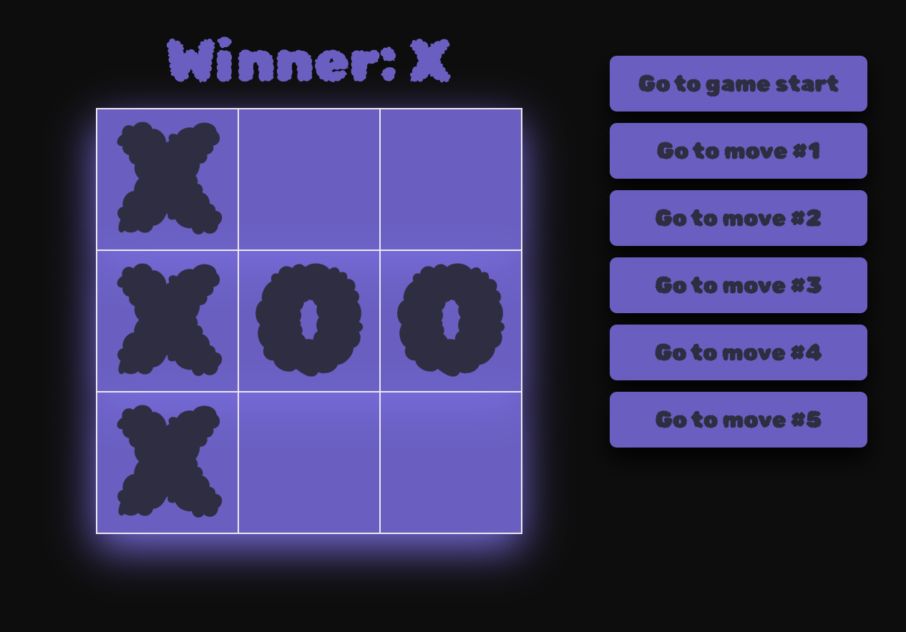

# React tic-tac-toe app



Based off the official react tutorial: https://react.dev/learn/tutorial-tic-tac-toe. I created this app to practice state managment and conditional rendering in React. Styled with custom vanilla CSS.


## Features

- Standard Gameplay
- Winner Message
- Ability to retrack to previous game states
- Responsive design


## Breakdown

The game is divided into three components:

`Square`: Individual square on the board. It takes two props: `value` to display the markings, and `onSquareClick` to handle click events on the square.

`Board`: Composed of the squares. Manages the state of the board and renders which player has the current turn an who ends up as the winner.

`Game`: Serves as the main container. `useState` hook is used to manage the history of moves and the current move. Renders the move history as buttons. Props like `xIsNext` and `onPlay` are passed to the board component.

## Run Locally

Clone the project

```bash
  git clone https://github.com/jahnltib/react-tic-tac-toe
```

Go to the project directory

```bash
  cd .../react-tic-tac-toe
```

Install dependencies

```bash
  npm install
```

Start the server

```bash
  npm run start
```
